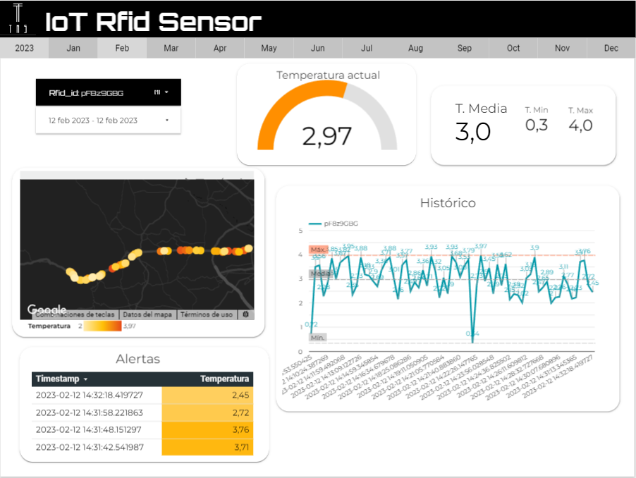

# **DATA PROJECT 2** 
## EDEM Master Data Analitycs 22/23
---
### TMS (Trace Mobility Systems)
---


This project is a simulation of an RFID sensor that measures temperature from RFID tags in realtime. This tags can be attached to any kind of products but in this case we selected food to ensure the cold chain along the whole transport by checking max/min temperature for each product and sending an alert to truck driver. It also provides (fake) geolocation to know where the temperature alert happenend. This data is registered in a BigQuery database for later analysis and visualization in Looker Studio.

# Team

|Nombre|Github|
|:-----:|:-----------:|
|Iván Pla|__[ivplagar/](https://github.com/ivplagar)__|
|Lara Peiró|__[larapeiro/](https://github.com/larapeiro)__|
|Rafa Cuquerella|__[RafaelCuquerella/](https://github.com/RafaelCuquerella)__|
|Carlos Torres|__[CarlosTorresAracil/](https://github.com/CarlosTorresAracil)__|
|Iván Rodríguez|__[ivrore/](https://github.com/ivrore)__|

# Getting started
## Requirements
- [Install Cloud SDK](https://cloud.google.com/sdk/docs/install) (only if running from local)
- [Google Cloud Account - Trial](https://console.cloud.google.com/freetrial])

## Enable APIs

To use Dataflow is neccesary to enable the following APIs for GCP by running the commands:
```
gcloud services enable dataflow.googleapis.com --project <PROJECT_ID>
gcloud services enable cloudbuild.googleapis.com --project <PROJECT_ID>
```
## PubSub
---
Create <ins>topics</ins> to receive messages from Rfid sensor in Google Cloud Platform.

+ *rfid_input* - This topic receives all information from rfid sensor.
+ *admin_output* - This topic outputs data right after adding processing time and temperature status.
+ *alert_output* - This topic only receives temperature alerts.This topic should be indicated in cloud function.

When running dataflow command arguments should be indicated as follows:
```
--input_subscription rfid_input-sub  
--output_topic admin_output
--alert_output_topic alert_output
```

## Cloud Storage
---
Create a bucket in <ins>Cloud Storage</ins> to store temp and staging files for the Dataflow pipeline.
You will have to fill the argument with this name.

```
--temp_location gs://<BUCKET_NAME>/tmp \
--staging_location gs://<BUCKET_NAME>/stg
```

## Big Query
---
Create data set in Google BigQuery. There is no need to create a table, you will indicate de name right after the dataset when running dataflow script.
```
<DATASET>.<TABLE>
```
## API hostname
---
To call the API fill the hostname as follows:
```
--hostname https://retoolapi.dev
``` 
## Cloud function
---
Create cloud function in order to filter temperature alerts and send them to topic.
 
Add the following environment variables:


# Run dataflow in GCP

1. Clone repository in GCP shell:
```
 git clone <REPO_NAME>
```
2. Run **generator.py** script in GCP shell:
```
cd Generator/Iotsensor
python generator.py \
    --project_id <PROJECT_ID> \
    --topic_name <INPUT_PUBSUB_TOPIC>
```
3. Run **dataflow.py** script to start dataflow pipeline in GCP shell: 
```
python dataflow.py \
    --project_id <PROJECT_ID> \
    --hostname <HOSTNAME> \
    --input_subscription <INPUT_PUBSUB_SUBSCRIPTION> \
    --output_topic <OUTPUT_PUBSUB_TOPIC> \
    --output_bigquery <DATASET>.<TABLE> \
    --runner DataflowRunner \
    --job_name <YOUR_DATAFLOW_JOB> \
    --region <GCP_REGION> \
    --temp_location gs://<BUCKET_NAME>/tmp \
    --staging_location gs://<BUCKET_NAME>/stg
```
# Visualization

