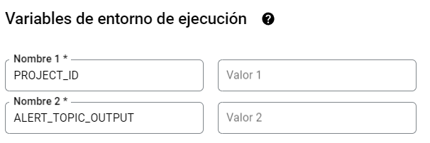

# **DATA PROJECT 2** 
## EDEM Master Data Analitycs 22/23
---
### TMS (Trace Mobility Systems)
---


|Nombre|Github|
|:-----:|:-----------:|
|Iván Pla|__[ivplagar/](https://github.com/ivplagar)__|
|Lara Peiró|__[larapeiro/](https://github.com/larapeiro)__|
|Rafa Cuquerella|__[RafaelCuquerella/](https://github.com/RafaelCuquerella)__|
|Carlos Torres|__[CarlosTorresAracil/](https://github.com/CarlosTorresAracil)__|
|Iván Rodríguez|__[ivrore/](https://github.com/ivrore)__|

# Getting started
## PubSub
---
Create <ins>topics</ins> to receive messages from Rfid sensor in Google Cloud Platform.

+ *rfid_input* - This topic receives all information from rfid sensor.
+ *admin_output* - This topic outputs data right after adding processing time and temperature status.
+ *alert_output* - This topic only receives temperature alerts.This topic should be indicated in cloud function.

When running dataflow command arguments should be indicated as follows:
```
--input_subscription rfid_input-sub  
--output_topic admin_output
--alert_output_topic alert_output
```

## Cloud Storage
---
Create a bucket in <ins>Cloud Storage</ins> to store temp and staging files for the Dataflow pipeline.

## Big Query
---
Create data set in Google BigQuery. There is no need to create a table, you will indicate de name right after the dataset when running dataflow script.
```
<DATASET>.<TABLE>
```
## API hostname
---
To call the API fill the hostname as follows:
```
--hostname https://retoolapi.dev
``` 
## Cloud function
---
Create cloud function in order to filter temperature alerts and send them to topic.
 
Add the following environment variables:



# Run dataflow in GCP

1. Clone repository in GCP shell:
```
 git clone <REPO_NAME>
```
2. Run **generator.py** script in GCP shell:
```
cd Generator/Iotsensor
python generator.py \
    --project_id <PROJECT_ID> \
    --topic_name <INPUT_PUBSUB_TOPIC>
```
3. Run **dataflow.py** script to start dataflow pipeline in GCP shell: 
```
python dataflow.py \
    --project_id <PROJECT_ID> \
    --hostname <HOSTNAME> \
    --input_subscription <INPUT_PUBSUB_SUBSCRIPTION> \
    --output_topic <OUTPUT_PUBSUB_TOPIC> \
    --output_bigquery <DATASET>.<TABLE> \
    --runner DataflowRunner \
    --job_name <YOUR_DATAFLOW_JOB> \
    --region <GCP_REGION> \
    --temp_location gs://<BUCKET_NAME>/tmp \
    --staging_location gs://<BUCKET_NAME>/stg
```
